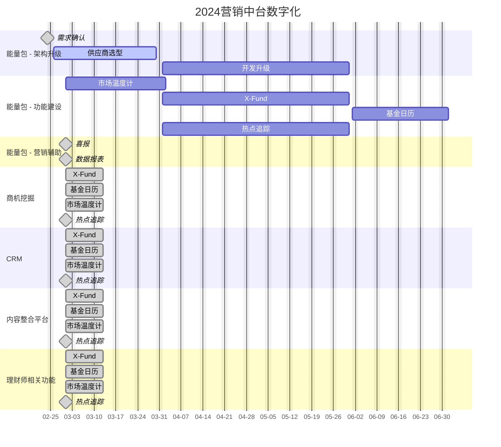

```mermaid
gantt
  dateFormat  YYYY-MM-DD
  excludes    weekends
  axisFormat %m-%d
  tickInterval 1week

	title 2024营销中台数字化
    
	section 能量包 - 架构升级
    需求确认: done, milestone, 2024-02-24, 0d
    供应商选型: active, 2024-02-26, 25d
    开发升级: 2024-04-01, 44d
    
	section 能量包 - 功能建设
	市场温度计:  2024-03-01, 22d
	X-Fund: 2024-04-01, 44d
	基金日历: 2024-06-01, 22d
	热点追踪:  2024-04-01, 44d

    section 能量包 - 营销辅助
	喜报: done, milestone, 2024-03-01, 0d
    数据报表: done, milestone, 2024-03-01, 0d

	section 商机挖掘
	X-Fund: done, 2024-03-01, 8d
	基金日历: done, 2024-03-01, 8d
	市场温度计: done, 2024-03-01, 8d
	热点追踪: done, milestone, 2024-03-01, 0d

	section CRM
	X-Fund: done, 2024-03-01, 8d
	基金日历: done, 2024-03-01, 8d
	市场温度计: done, 2024-03-01, 8d
	热点追踪: done, milestone, 2024-03-01, 0d

    section 内容整合平台
	X-Fund: done, 2024-03-01, 8d
	基金日历: done, 2024-03-01, 8d
	市场温度计: done, 2024-03-01, 8d
	热点追踪: done, milestone, 2024-03-01, 0d

    section 理财师相关功能
	X-Fund: done, 2024-03-01, 8d
	基金日历: done, 2024-03-01, 8d
	市场温度计: done, 2024-03-01, 8d
	热点追踪: done, milestone, 2024-03-01, 0d
```
