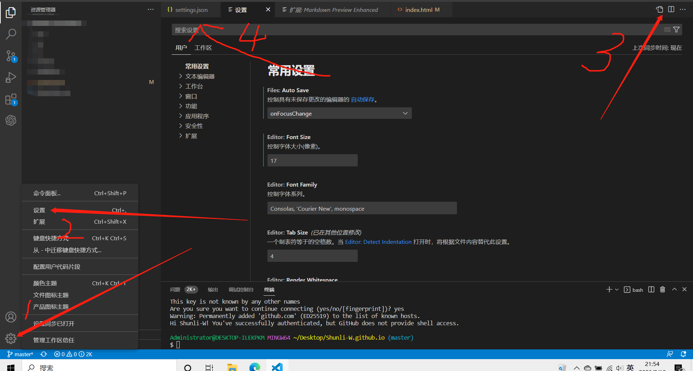

## 安装git

## 配置文件

    //配置git
    "git.path": "D:/PortableGit/bin/git.exe",
    "git.enableSmartCommit": true,
    "update.mode": "none",
    //配置git.bash
    "terminal.integrated.profiles.windows": {
        "PowerShell -NoProfile": {
            "source": "PowerShell",
            "args": [
                "-NoProfile"
            ]
        },
        "Git Bash": {
            "path": "D:/PortableGit/bin/bash.exe",
            "args": []
        }
    },
    "terminal.integrated.defaultProfile.windows": "Git Bash",
    "terminal.integrated.fontFamily": "Consolas",
    "git.confirmSync": false,

## 配置git和本地ssh key
